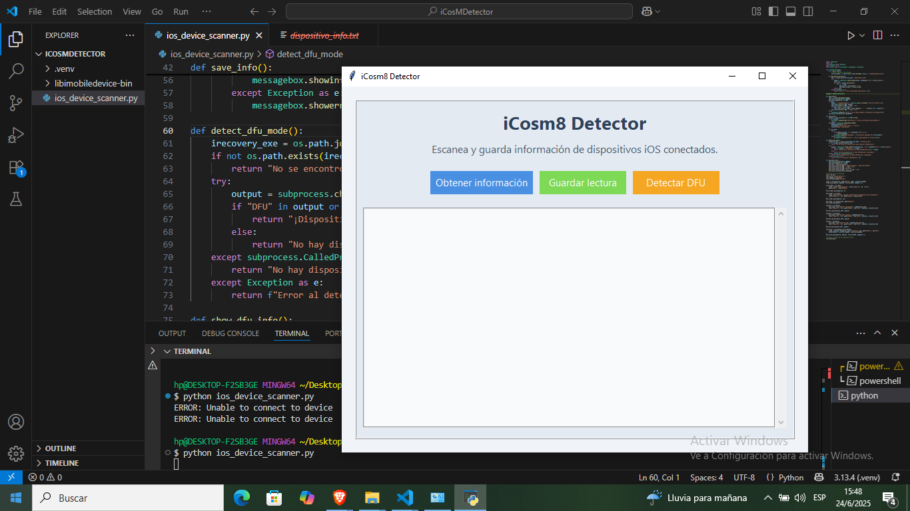

# iCosm8 Detector

**iCosm8 Detector** es una herramienta gráfica para Windows que permite escanear información de dispositivos iOS conectados y detectar si están en modo DFU/Recovery. Utiliza los binarios de [libimobiledevice-win32](https://github.com/libimobiledevice-win32/imobiledevice-win32) integrados en la carpeta del proyecto.

## Características

- Escaneo de información detallada de dispositivos iOS conectados.
- Detección de dispositivos en modo DFU/Recovery.
- Guardado de la información obtenida en archivos `.txt`.
- Interfaz gráfica amigable y fácil de usar.

## Vista de la aplicación




## Requisitos

- Windows 10/11
- Python 3.8 o superior
- Los binarios de `libimobiledevice-win32` y `irecovery.exe` deben estar en la carpeta `libimobiledevice-bin` dentro del proyecto.

## Instalación

1. **Clona o descarga este repositorio.**
2. **Descarga los binarios de libimobiledevice-win32**  
   [Descargar aquí](https://github.com/libimobiledevice-win32/imobiledevice-win32/releases)
3. **Extrae los ejecutables** (`ideviceinfo.exe`, `irecovery.exe`, etc.) en la carpeta `libimobiledevice-bin` dentro del proyecto.
4. **Instala las dependencias de Python:**

   ```bash
   pip install tk pillow
   ```

   *(Tkinter suele venir preinstalado con Python en Windows, pero puedes instalarlo si es necesario.)*

## Uso

1. Ejecuta el script principal:

   ```bash
   python ios_device_scanner.py
   ```

2. Usa la interfaz gráfica para:
   - Obtener información del dispositivo iOS conectado.
   - Detectar si hay un dispositivo en modo DFU/Recovery.
   - Guardar la información mostrada en un archivo de texto.

## Estructura del Proyecto

```
iCosMDetector/
│
├─ ios_device_scanner.py
├─ libimobiledevice-bin/
│    ├─ ideviceinfo.exe
│    ├─ irecovery.exe
│    └─ ...otros ejecutables...
├─ logo.png
└─ README.md
```

## Notas

- **No es posible leer la versión de iOS de un dispositivo en modo DFU**, ya que el dispositivo no expone esa información en ese estado.
- Si no tienes los ejecutables en la carpeta correcta, la aplicación mostrará un mensaje de error.

## Créditos

- [libimobiledevice-win32](https://github.com/libimobiledevice-win32/imobiledevice-win32)
- Interfaz gráfica desarrollada con [Tkinter](https://docs.python.org/3/library/tkinter.html)

---
Desarrollado por Cosm3No1de.dev
